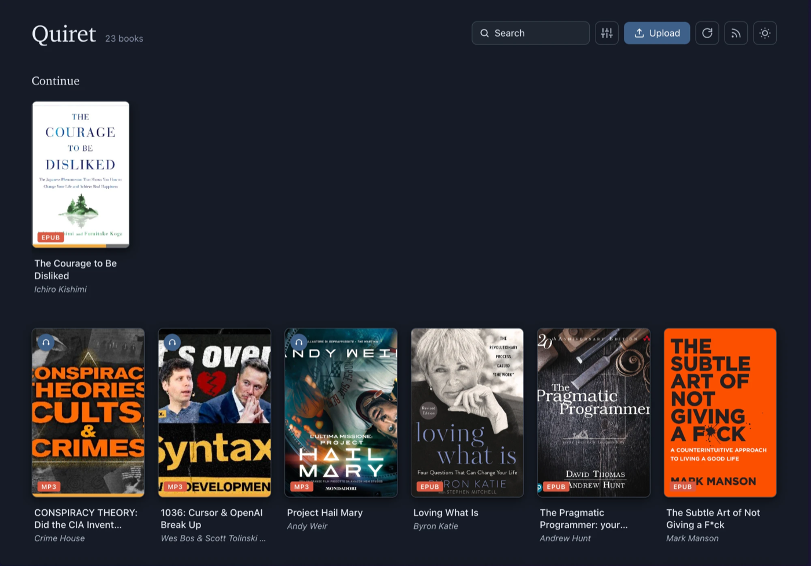

# Quiret

A minimal, low-footprint ebook & audiobook library for your home server.



## Features

- **Reads everything** — EPUB, FB2, and CBZ (via Foliate-js), PDF (via PDF.js), and MP3 / M4B / M4A / AAC / OGG / Opus audiobooks in a built-in player.
- **Audiobook player** — resume, variable speed, skip, a sleep timer, embedded chapters (M4B), and lock-screen / background playback via the Media Session API.
- **Podcasts** — paste an RSS feed to browse and download episodes into your library; save feeds as subscriptions and pull new episodes whenever you like.
- **Covers & metadata** — auto-extracted for every format (chapter markers for M4B), and editable in-app (title, author, cover).
- **Organized library** — search, sort, filter by type, a "Continue" shelf for in-progress items, and a table-of-contents panel for ebooks and PDFs.
- **Annotations & progress** — highlights and notes that persist, and your reading/listening position is remembered.
- **Installable PWA** — add it to your home screen for a full-screen, app-like experience.
- **Easy imports** — drag-and-drop upload, recursive folder scanning, and a manual rescan button.
- **Tiny footprint** — ~30MB Docker image; one static Go binary and one SQLite file. No Calibre, no JVM, no Node at runtime — `poppler-utils` is the only system dependency. Designed for a Pi, NAS, or any low-power box.

## Tech Stack

**Backend:** Go · SQLite · Gorilla Mux

**Frontend:** Svelte · Foliate-js · PDF.js · Vite

## Self-hosting with Docker

1. Clone this repository:
   ```bash
   git clone <repo-url>
   cd quiret
   ```

2. Create an `.env` file at the root, using `.env.example` as a starting point.

3. Start the application:
   ```bash
   docker-compose build
   docker-compose up -d
   ```

4. Open your browser at `http://localhost:8080` (or whatever `PORT` you set).

Your library lives in a Docker volume and persists between restarts.

## Usage

1. **Upload** — drag and drop EPUB, PDF, FB2, CBZ, or audio files anywhere, or click **Upload**.
2. **Auto-import** — place files in `BOOKS_PATH` (and/or `AUDIOBOOKS_PATH`); they're scanned recursively on startup, or hit **Rescan** to pick up new ones without restarting.
3. **Browse** — search, sort, and filter by type from the controls menu; jump back into anything in progress from the **Continue** shelf.
4. **Read** — click a book to open the reader; turn pages with arrow keys or swipe, and use the **Contents** panel to jump between chapters.
5. **Listen** — audiobooks open a player with variable speed, skip, a sleep timer, chapters, and background / lock-screen controls.
6. **Podcasts** — click the RSS icon, paste a feed URL, and download episodes; save a feed to fetch new episodes later.
7. **Annotate & edit** — select text to highlight and add notes, and edit a book's title, author, or cover from its card.

## Development

**Backend:**
```bash
cd backend
go run .
```

**Frontend:**
```bash
cd frontend
npm install
npm run dev
```

## Configuration

**Environment variables:**

| Variable | Description | Default |
|----------|-------------|---------|
| `DATA_PATH` | Where the database and extracted covers are stored | `./data` |
| `BOOKS_PATH` | Folder(s) to scan for books; colon-separated, may be read-only | `./data/books` |
| `AUDIOBOOKS_PATH` | Optional additional folder to scan (e.g. audiobooks) | — |
| `PORT` | Port the server listens on | `8080` |
| `STATIC_PATH` | Path to the built frontend (set automatically in Docker) | — |
| `CORS_ORIGIN` | Allowed CORS origin (only needed for local dev) | — |

## License

MIT
